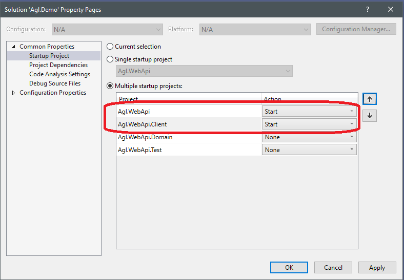
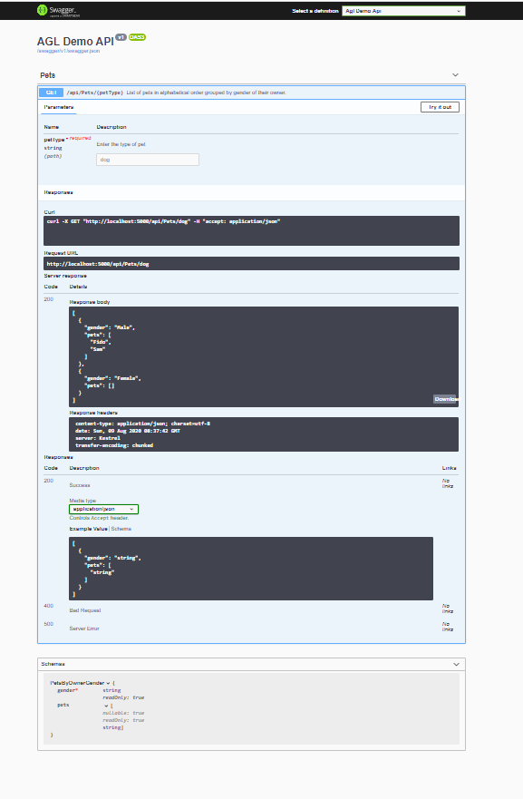
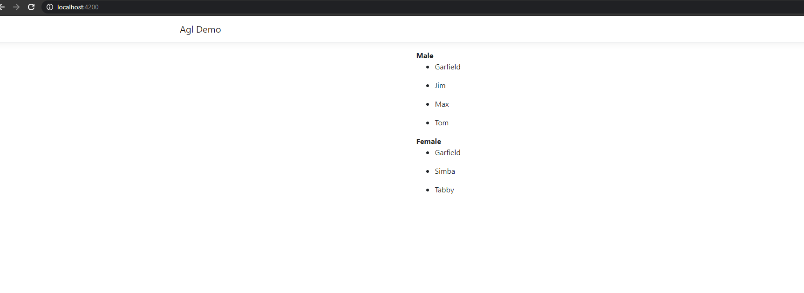

# Agl Demo application

Problem: 
http://agl-developer-test.azurewebsites.net/

[](https://www.microsoft.com/net/download/dotnet-core/3.1) |[](https://nodejs.org/en/download/) | [](https://angular.io/) |  |  | 
| --- | ---          | ---        | ---      | ---        |  --- |

---------------------------------------

## Repository codebase
 
The repository consists of projects as below:


| # |Project Name | Project detail | location| Environment |
| ---| ---  | ---           | ---          | --- |
| 1 | Agl.WebApi | Asp.Net Core WebApi as backend  |  **Backend** folder | [](https://www.microsoft.com/net/download/dotnet-core/3.1)|
| 2 | Agl.WebApi.Domain | Business logic  |  **Backend** folder | [](https://www.microsoft.com/net/download/dotnet-core/3.1)|
| 3 | Agl.WebApi.Test | Unit Test for Api |  **Backend.Test** folder | [](https://www.microsoft.com/net/download/dotnet-core/3.1)| 
| 4 | Agl.WebApi.Client | angular application   | **Frontend** folder | [](https://nodejs.org/en/download/)  [](https://angular.io/) |

##### Environment Setup

> Download/install   	
>	1. [](https://www.microsoft.com/net/download/dotnet-core/3.1) to run Agl.WebApi and Agl.WebApi.Test project
>   
>   2. [](https://nodejs.org/en/download/) to run the angular [front end] application
>   
>	3. [](https://visualstudio.microsoft.com/vs//) to run/debug the applications
>   
>   4. Please install angular-cli version 8 [](https://angular.io/)
>   

##### Project Setup to run the application

>   1. Please clone or download the repository from [](https://github.com/AJEETX/AGL.Code.Demo) 
>   
>   2. Unzip the downloaded repository and open the solution file **AGL.Code.Demo.sln** in Visual Studio 2019.
>
>   3. To start backend and frontend applications, the solution needs to be setup with **Multiple startup projects**
>   
>   4. To setup as **Multiple startup projects**, Right click on solution file in **Visual Studio 2019** solution explorer and select **Properties** in the context menu.
>
>   5. Goto **Common Properties** -> **Startup Project**. On the right pane click the radio button **Multiple startup projects**.
>
>   6. In the below pane, the projects **Agl.WebApi** and **Agl.WebApi.Client** 'Action' need to set to **Start** by selecting from the dropdown in sequence.Click OK. See below
>
>   
>
>   7. All is set, click the **Start** button to run the demo application.
>
>   8. The backend WebApi shall open in browser with url **http://localhost:5000/**, if not then manually open chrome browser with the url.

>   
>
>   9. The frontend application shall open in browser with url **http://localhost:5050/**, if not then manually open chrome browser with the url.
>     
>   

```
note: For better experience please use chrome browser.
```
```
happy coding :)
```
